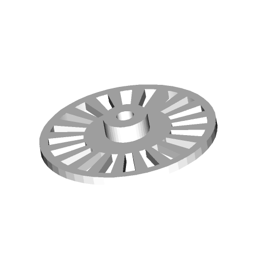

# node-jsc3d

Node wrapper for
[JSC3D](https://github.com/xxv/jsc3d/tree/master/jsc3d), a
cool little (unmaintained?) 3D model renderer originally written for
the browser.

Supports in-memory, software rendering of certain 3D Models with a
simple interface, great for generating previews of STL or OBJ files.

# Usage

Install locally with:

```sh
npm install --save jsc3d
```

NOTE: It (presently) relies on `node-canvas` for PNG rendering and
canvas implementation. This requires Cairo and Pango to be installed on
the host system. [Read more
here.](https://github.com/Automattic/node-canvas)

## As library

### Using `render` helper method

Provides a few helper methods, notably `render`, for more easily
interacting with JSC3D.  See `bin/jsc3d.js` for full example of using
`render`.

```javascript
const jsc3d = require('jsc3d');
const canvas = jsc3d.makeCairoCanvas(500, 500);
jsc3d.render({canvas}, () => {
    const buf = canvas.toBuffer(undefined, 3, canvas.PNG_FILTER_NONE);
    fs.writeFile(outputPath, buf, error => {
        if (error) {
            throw error;
        }
    });
});
```

### Using JSC3D directly

The original [JSC3D API](https://github.com/xxv/jsc3d/tree/master/jsc3d/docs) is also
directly exposed.

```javascript
const jsc3d = require('jsc3d');
const canvas = jsc3d.makeCairoCanvas(500, 500);
const viewer = new jsc3d.Viewer(canvas);
viewer.setParameter('SceneUrl', 'path/to/file.stl');
viewer.setParameter('InitRotationX', -45);
viewer.setParameter('RenderMode', 'smooth');

jsc3d.onLoaded(() => {
    // Called when STL file has been read in
    viewer.doUpdate();

    // At this point the canvas has been written to
});
viewer.init();
```

## As stand-alone program

Install globally with

```bash
npm install -g jsc3d
```

### Solid render

```bash
jsc3d examples/example.stl examples/example.png
```


### Example wireframe render

This node wrapper exposes all arguments as CLI arguments, also.

```bash
jsc3d --ModelColor=#00ff00 --RenderMode=wireframe --BackgroundColor1=#000000 \
    --BackgroundColor2=#000000 examples/example.stl examples/example_wireframe.png
```


# License

To match JSC3D, this wrapper is also released under MIT License.

# TODO

- [ ] Background images do not load: need to mock HTML Image interface

- [ ] Implement new, simpler mock canvas using Buffer to avoid Cairo
dependency

- [ ] Monkey patch JSC3D's BinaryStream with a faster implementation
using Buffer

